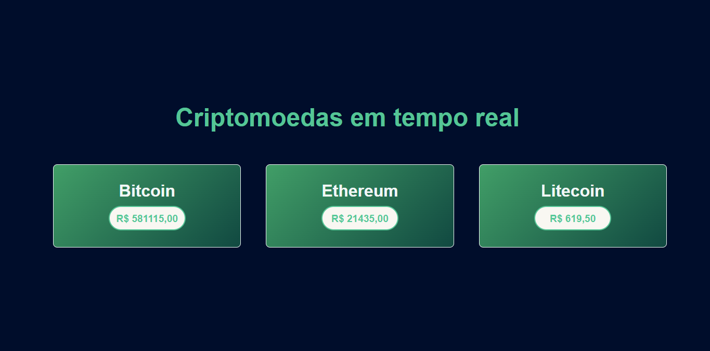

# Preços de Criptomoedas em Reais

 
Demonstração da tela

Este projeto é uma aplicação web simples que exibe os preços atuais das criptomoedas Bitcoin, Ethereum e Litecoin em reais (BRL). Utiliza a API da CoinGecko para obter os dados atualizados.

## Tecnologias Utilizadas

- **HTML**: Estrutura da página web.
- **CSS**: Estilização da interface.
- **JavaScript**: Lógica para buscar e exibir os preços das criptomoedas.
- **API**: CoinGecko para obter os preços das criptomoedas.

## Funcionalidades

- Exibição dos preços das criptomoedas em tempo real.